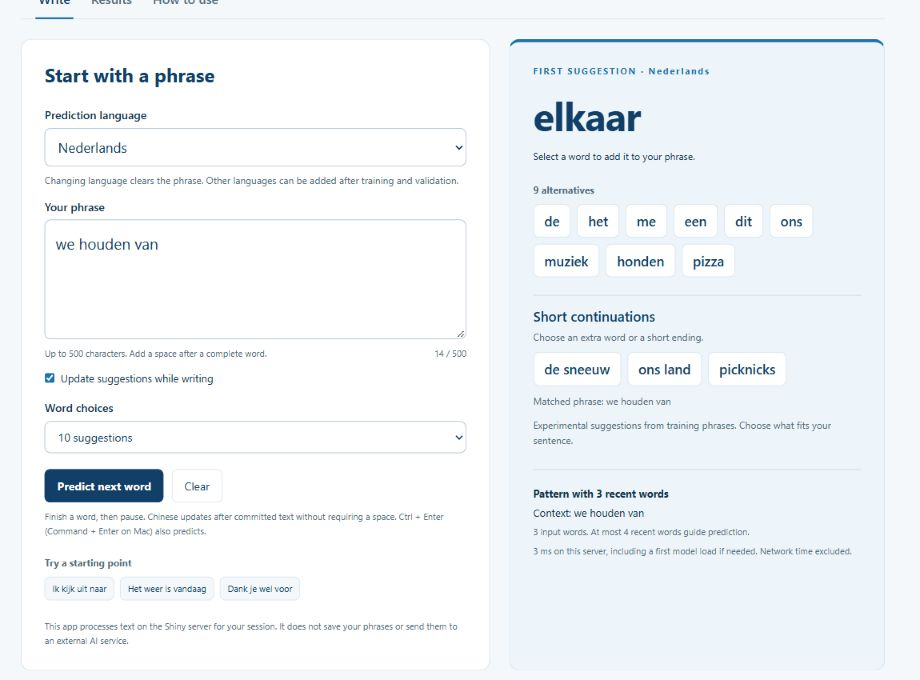
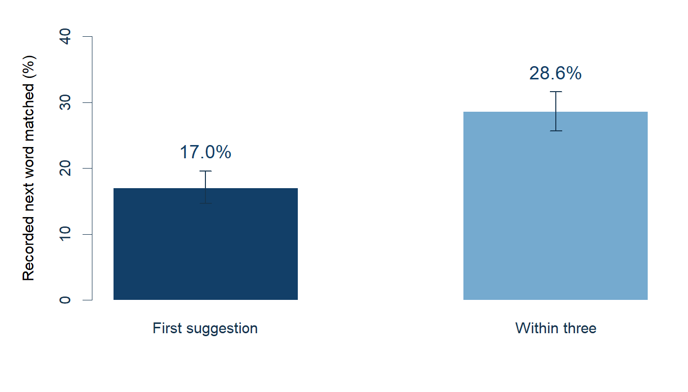
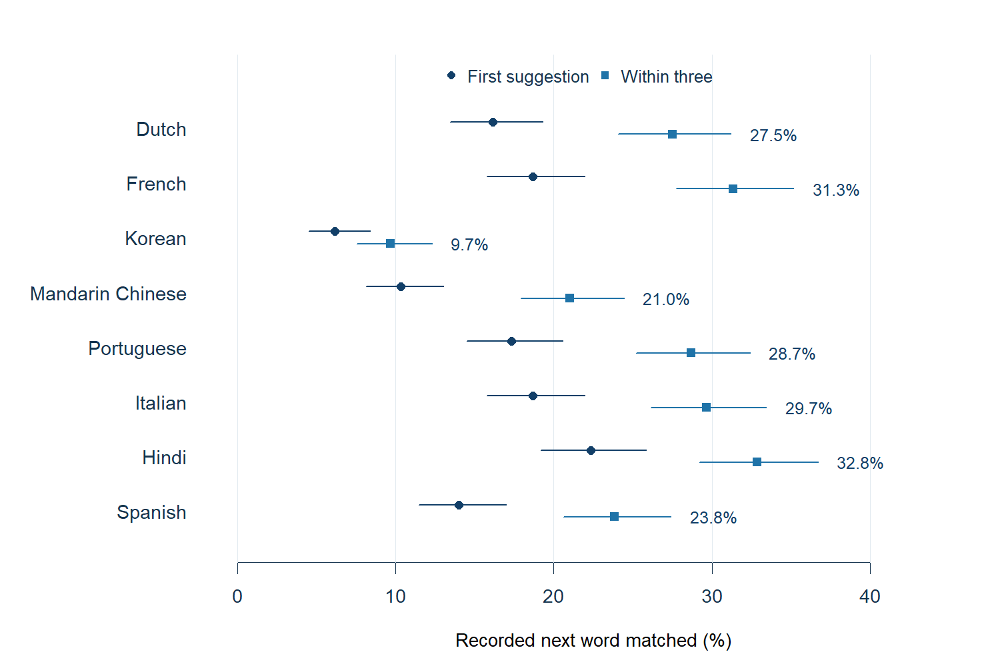

```{r setup,include=FALSE}
library(jsonlite);library(data.table)
knitr::opts_chunk$set(echo=FALSE,message=FALSE,warning=FALSE)
latest<-fromJSON('../research/languages-20260926-v13/metrics.json',simplifyVector=FALSE)
prior<-fromJSON('../research/multilingual-20260926/metrics.json',simplifyVector=FALSE)
checks<-fromJSON('../research/continuations-20260926-v14/checks.json')
make_rows<-function(values){rbindlist(lapply(names(values),function(code){d<-values[[code]];m<-d$overall
 label<-if(is.null(d$language_name))c(de_DE='German',fi_FI='Finnish',ru_RU='Russian')[[code]] else d$language_name
 data.table(Language=label,First=sprintf('%d/%d (%.1f%%)',m$top1_count,m$cases,100*m$top1),
  Three=sprintf('%d/%d (%.1f%%)',m$top3_count,m$cases,100*m$top3),
  Interval=sprintf('%.1f%% to %.1f%%',100*m$top3_low,100*m$top3_high),
  Reference=sprintf('%.1f%%',100*m$unigram_top3),Training=d$training_lines,Median=d$median_ms,MiB=d$model_mib)
}))}
newtab<-make_rows(latest);oldtab<-make_rows(prior)
```

<style>caption{color:#526d81!important}.figure img{max-width:100%;height:auto}.guide-cta{display:inline-block;padding:9px 15px;background:#123f68;color:white!important;border-radius:4px}</style>

<div class="summary-box">
**Sonja PhraseFlow suggests the next word in twelve selectable languages.** English, Dutch, French, German, Finnish, Russian, Korean, Mandarin Chinese, Portuguese, Italian, Hindi and Spanish each use a separate model. The additional languages remain experimental. A suggestion is a learned continuation, not a guarantee of meaning or correctness.
</div>

## Quick start

1. Select **Prediction language** before writing. The language menu uses native names, including Nederlands, Français, 한국어, 中文（普通话） and हिन्दी.
2. Enter a phrase. For languages written with spaces, finish the word and add a space, or press **Predict next word**. Chinese does not require spaces.
3. Click a suggestion to append it. **Word choices** selects 5, 10 or 20 visible suggestions. **Short continuations** offers extra words or endings where training text matches. Continue typing to update the suggestions.
4. Use **Results** for the selected language's accuracy, graph and timing. Use **Clear** to start again.

The **User guide / Handleiding** button above the writing area opens this document. The **How to use** tab contains a shorter guide and a link to training-data credits. Ctrl + Enter, or Command + Enter on a Mac, triggers prediction. Switching language clears the phrase and old suggestions; it does not translate text. The interface labels remain English.



## More choices and short continuations

The first suggestion stays prominent; the other selected word choices are all visible beneath it. Select **5, 10 or 20 suggestions** to adjust the amount shown. More choices help a writer find a suitable alternative, but do not improve the ranking of the first suggestion.

**Short continuations** is a separate, experimental lookup of endings from existing training sentences. It matches the last two to four normalized units and offers up to three alternatives. Three- or four-unit matches can add an observed ending of up to three units. Two-unit matches offer only the next unit because there is less context. The matched phrase appears below the buttons. No match means that no extra continuation is shown.

The lists were built from the existing training files in all twelve languages. Candidate endings are ranked by their training frequency; no quiz answers or evaluation targets were added. Only contexts with at least two retained training occurrences are kept. Selecting a button appends its words, then the predictor updates for the new text. Chinese continues without inserted spaces. The existing next-word scores are unchanged.

For example, the Dutch next-word model already ranks **elkaar** first after **we houden van**. The extra lookup can offer **gelukkig** after the suffix **lang en**, which the compact next-word ranking missed. These are inspected demonstrations, not independent accuracy measurements. A local phrase match can still be inappropriate for the meaning of the entire sentence. The app does not yet reliably understand a writer's intention or guarantee a natural complete sentence.

## Chinese, Korean and Hindi input

Chinese text is divided into units using the ICU word dictionary. Suggested Chinese text is appended **without inserting spaces**. The unit is the segment found by ICU, which need not match every reader's preferred word boundary. This version covers Mandarin corpus text, not every Chinese language or regional variety.

Korean predicts an **eojeol**, a unit separated by spaces that may include grammatical endings. Hindi vowel signs and other combining marks are retained; accented Latin letters and Cyrillic text are also preserved. When an input method is composing characters, automatic prediction pauses until the text is committed.

The app accepts up to 500 characters and can receive a complete sentence. Predictions use at most the four most recent normalized units. The model does not use the full sentence's meaning, translate text or learn from the current session. For an unfamiliar phrase, shorter patterns and frequent words provide a fallback.

## How performance is measured

**First** means the first suggestion equals the recorded next word. **Within three** means that word appears among the first three. Other continuations may be reasonable, but the test scores exact matches. A **95% interval** describes sampling uncertainty around a test percentage; it is not confidence in an individual suggestion. Individual confidence has not been calibrated.

The English results below are from the archived independent evaluation. The reserved English test cases were not reopened. A separate regression check confirmed identical words and scores on all 600 English development cases.



The English model matches the recorded next word first in **153/900 cases (17.0%; 95% interval 14.7–19.6%)** and within three in **257/900 (28.6%; 25.7–31.6%)**. All 900 received a suggestion. Receiving a suggestion and receiving the correct suggestion are separate outcomes.

## Eight additional languages

Dutch, French, Korean, Mandarin Chinese, Portuguese, Italian, Hindi and Spanish use **Tatoeba example sentences**, retrieved from the official exports dated 26 September 2026. Text was normalized and exact duplicates were removed before separating 600 held-out sentences per language. One target was chosen at random per held-out sentence. Candidate words were generated from the prefix only. Chinese prefixes were supplied without inserted spaces and segmented again without the target word.

Settings were fixed before evaluation: five-gram Kneser-Ney smoothing, discount 0.75, up to 40,000 vocabulary items, minimum count two, context support three and eight retained continuations per context. Up to 75,000 sentences were used per language; the Korean and Hindi sources supplied fewer eligible sentences. No setting was selected using these held-out outcomes.



```{r new-scores}
knitr::kable(newtab[,.(Language,`First correct`=First,`Within three`=Three,`95% interval: within three`=Interval)],caption='Initial Tatoeba evaluation. All 600 cases per language received suggestions.')
```

```{r training-and-speed}
knitr::kable(newtab[,.(Language,`Training sentences`=format(Training,big.mark=','),`Reference top-3`=Reference,`Median ms`=round(Median,2),`File MiB`=round(MiB,2))],caption='Reference: always suggest the three most probable words, ignoring the phrase. Timing: 1,200 warm CPU calls per language.')
```

These results apply to held-out sentences from the same example-sentence collection. Similar sentence templates can remain after exact deduplication. The corpus is volunteer-written, may contain errors and is not a representative sample of everyday messages or news. Different training sizes, scripts and prediction units prevent a fair language-to-language ranking. These new measurements must not be interpreted as an improvement over the English result.

## Earlier language prototypes

German, Finnish and Russian retain their earlier models trained on 75,000 course-corpus lines per language. Their 600-case evaluations contain 200 examples each from blogs, news and Twitter.

```{r earlier-scores}
knitr::kable(oldtab[,.(Language,`First correct`=First,`Within three`=Three,`95% interval: within three`=Interval)],caption='Earlier course-corpus prototypes. Different data from the new Tatoeba experiments.')
```

## Speed, memory and privacy

The archived inference times measure ten suggestions on the local CPU after loading. The current screen computes twenty word candidates and performs the additional ending lookup; the archived times do not benchmark that whole operation. They exclude network, display, first model load and the 150 ms typing pause. Chinese word segmentation is included in its inference measurement. Cold requests can take longer. A new local timing check on 600 reused English development prefixes measured a median of **1.81 ms** and a 95th percentile of **3.54 ms** for twenty word candidates plus the extra lookup. This is a warm CPU measurement, not browser response time or an accuracy test.

The cache retains English and at most three additional models. The maximum combined size of these prepared R model objects is approximately **`r sprintf('%.1f',checks$prepared_model_objects_maximum_mib)` MiB**. This includes the stored ending indexes but excludes the R process, Shiny, cached pages and temporary allocations; it is not total hosting memory. A language evicted from the cache loads again when selected.

Text is processed on the Shiny server for the active session. The app does not save entered phrases or send them to an external prediction API.

The next-word accuracy graphs apply to the unchanged word model. The supplementary ending lookup has not received an independent accuracy evaluation. Its training phrases are not an evaluation set.

## Discussion and next improvements

The expansion makes twelve languages usable through the same interface, while preserving the English predictions. It does not establish high accuracy or full-sentence understanding. Korean currently has the weakest measured top-three result among the new prototypes, with limited training text and many unseen forms. That combination makes additional representative Korean data and a comparison of segmentation methods a sensible next experiment, rather than a proven solution.

Further work should compare a compact context-aware model with this baseline, test representative unseen messages in each language, obtain native-speaker review and calibrate confidence after model selection. The current language hold-outs have now been examined; after tuning, a fresh final test is needed. More language choices and 100% prediction availability do not imply 100% accuracy.

## Sources and reproducibility

**Author: Sonja Sahebzad**  
**Utrecht, the Netherlands · Sonja Projects**

This HTML was knitted from `Multilingual_Guide.Rmd`. The project retains the `.Rproj`, app source, five-slide RStudio Presenter `.Rpres`, rendered HTML, fixed protocols, download checksums, per-case outcomes, CPU timings, checks and figure code. Model inference requires R, Shiny, data.table, jsonlite and stringi; no GPU or remote prediction API is needed. Open `Sonja PhraseFlow.Rproj`, open `app.R`, then select **Run App**.

Tatoeba contributors supplied the additional text under **CC BY 2.0 FR**. Training transformed it through normalization, segmentation and aggregation. The [data credits and attribution lists](https://sonja242.github.io/data-science-capstone-swiftkey/phraseflow-data-credits.html) retain contributor names and sentence URLs. Held-out answers remain private. The [live app](https://sonjasahebzad.shinyapps.io/sonja-next-word/) and [five-slide presentation](https://rpubs.com/Sonja_Janssen/sonja-next-word) accompany this guide. The [source repository](https://github.com/Sonja242/data-science-capstone-swiftkey/tree/main/final_project/phraseflow_multilingual) includes the R app, editable guide and native Presenter source. Python and R research scripts are retained separately from the CPU app.

Sources: [Tatoeba downloads and file definitions](https://tatoeba.org/en/downloads), [official SwiftKey course archive](https://d396qusza40orc.cloudfront.net/dsscapstone/dataset/Coursera-SwiftKey.zip), [ICU word-boundary analysis](https://unicode-org.github.io/icu/userguide/boundaryanalysis/), [Chen and Goodman, 1996](https://aclanthology.org/P96-1041/).
